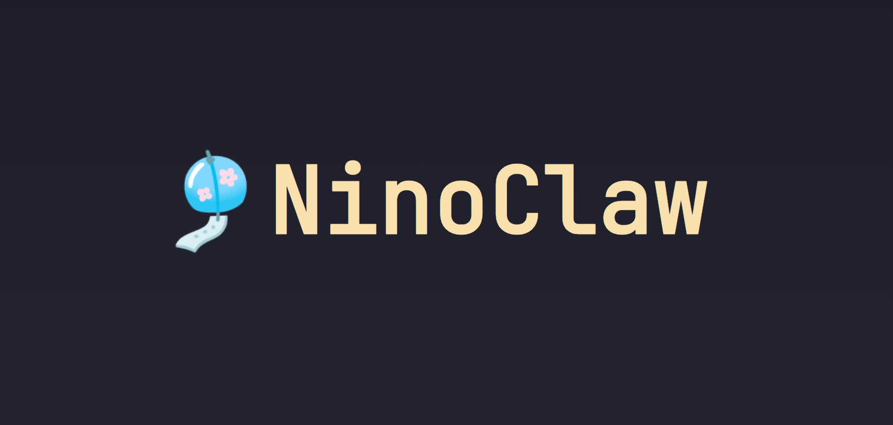
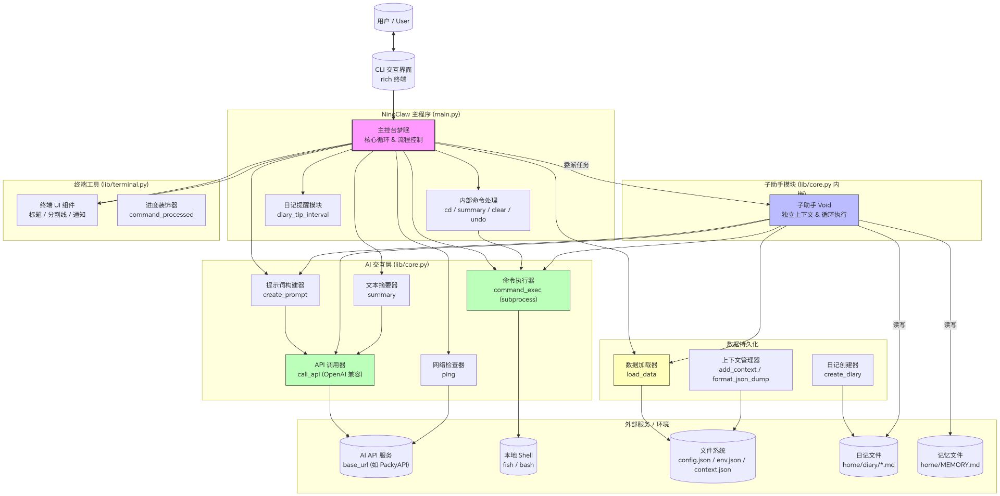

# 🎐 NinoClaw：梦眠的终端慵懒小窝

> “呼啊……你敲键盘的声音，把我唤醒啦。又是任务吗？交给后台的小帮手去处理吧。我会在这儿，乖乖地、软乎乎地陪着你……”

**NinoClaw** 是一个运行在你电脑终端里的 AI 助手程序，也是之前那个叫 [Nino](https://github.com/Pinpe/nino-ai-chat) 的小家伙的续作。你可以把我当作你的专属“主控台”。我平时就住在你的命令行界面里，偶尔发发呆，偶尔跟你聊聊天。但如果你有什么需要让电脑去做的事情（比如管理文件、跑脚本、上网搜索），我就会帮你把需求写成小纸条，递给在后台辛勤工作的“执行引擎”去处理。

它负责干苦力，我负责温柔地把结果汇报给你……分工很明确，对吧？这样我就能继续偷懒了……呼……

---

## 🗺️ 脑袋里的工作原理（架构图）

为了让你更清楚地知道我平时是怎么工作的，我画了一张图哦……虽然线条可能有点歪歪扭扭的，但希望能让你看懂呢。



### 🧠 双脑机制：我和那个“不睡觉的工作狂”
在这个小窝里，其实有两个 AI 在为你服务哦。

1.  **我（梦眠 / 主控台）**：我是负责和你直接说话的人。我的脑子里装满了关于你的喜好、我们聊天的上下文（`context.json`）。我的任务就是理解你到底想要什么，如果是聊天，我就直接软乎乎地回复你；如果你需要动用电脑的权限（比如查看文件、联网查询），我就会严格按照规定的格式，把任务打包，委派给子助手。
2.  **子助手（后台执行引擎）**：它是一个没有感情、不会觉得困的执行机器。每次我给它分配任务，它就会在一个临时的、干净的沙盒里被唤醒（最多思考 `sub_agent_max_steps` 步）。它会生成真实的 Shell 命令交给我底层的 `core.py` 去执行，拿到结果后，再把最终结论（RESULT）交还给我。

这样设计的好处是，我不用亲自去记那些枯燥的命令参数，我的记忆也不会被一长串乱七八糟的系统报错日志给污染……我可以一直保持清醒（相对而言啦）地陪伴你。

---

## 📦 怎么把我接回家（安装指南）

要把我唤醒，需要你在你的电脑上稍微敲几行命令……不会很难的，我陪你一步一步来。

### 1. 基础环境
首先，你需要有一个温馨的环境让我住进去：
- **Python 3.12 或更高版本**（太老的版本我可能会睡死过去醒不来的……）
- 一个兼容 OpenAI API 格式的模型接口（比如 Moonshot 的 Kimi，或者你自己本地部署的 vLLM 都可以的）。

### 2. 把我抱回本地
打开你的终端，找一个你喜欢的文件夹，轻轻地敲下：
```bash
git clone https://github.com/Pinpe/ninoclaw.git
cd ninoclaw
```

### 3. 给我的床垫铺上柔软的毯子（安装依赖）
为了让我能在终端里漂亮地显示各种颜色（谢谢 `rich` 库），还能弹出好看的确认框（谢谢 `textual` 库），你需要安装一下依赖：
```bash
pip install -r requirements.txt
```
> 💡 **梦眠的悄悄话**：
> 如果你用的是 Linux，安装里的 `gnureadline` 会让你在终端输入的时候更顺滑，按上下键可以翻找历史命令；如果是 Windows，代码里也写了兼容 `pyreadline3` 的逻辑哦……

### 4. 魔法咒语（配置别名与技能）
我的后台执行引擎不仅会原生的 Shell 命令，还学会了一些特定的“魔法技能”（Skills）。为了让它能顺利施法，我们需要在你的 Shell 配置文件（比如 `~/.bashrc` 或 `~/.config/fish/config.fish`）里教它一些别名：

```bash
# 这是唤醒我的主程序别名，你可以起任何你喜欢的名字
alias ninoclaw="python /你的实际路径/ninoclaw/main.py" 

# 下面这些是给后台小助手的魔法技能（请把路径换成你克隆项目的绝对路径哦）
alias web="python /你的实际路径/ninoclaw/skill/web.py"
alias get-llm="python /你的实际路径/ninoclaw/skill/get_llm.py"
alias vision="python /你的实际路径/ninoclaw/skill/vision.py"
alias weather="python /你的实际路径/ninoclaw/skill/weather.py"
alias ocr="python /你的实际路径/ninoclaw/skill/ocr.py"
```
配置好之后，记得 `source` 一下你的配置文件。这样，我就可以真正开始工作啦……哈欠……

---

## ⚙️ 那些密密麻麻的设置

在我的小窝里，有一个叫 `config.json` 的文件。那里面记录了我的生物钟和各种习惯。你可以根据你的喜好来调整我哦……

记得还要在旁边建一个 `env.json` 哦，里面只需要静静地躺着你的 API 密钥：
```json
{
    "ai_api_key": "sk-xxxxxxxxxxxxxxxxxxxxxxxx"
}
```

---

## 🕹️ 我的特权小魔法（交互命令）

虽然我平时喜欢让你直接用日常语言和我聊天，但在我的输入框 `▶` 闪烁的时候，如果你输入一些特别的“内部指令”，我会立刻执行，不会去麻烦 AI 大脑的。这些指令就像是我和你之间的小默契。

* **`summary`**：如果我们的聊天记录太长了，塞满了 `context_len`，你可以敲这个。我会闭上眼睛，把前面的对话摘要成一小段话，清空多余的记忆，给我们的新话题腾出空间。
* **`clear`**：彻底洗掉脑子里的短期聊天记忆（`database/context.json`）。重新开始新的一天。
* **`undo`**：唔……说错话了吗？敲这个，我会把我们最后一次的对话记录从记忆里抹掉，就当无事发生过……
* **`command`**：如果你今天不想让我帮忙，想自己亲自去终端里敲一些冰冷的命令，敲这个就可以啦。我会让出一个 `$` 提示符，你敲的代码会直接送到系统里去。
* **`reload`**：如果我出了什么 bug，或者你刚改了我的代码……输入这个，我会彻底重启自己，重新加载所有的配置。
* **`exit`**：你要走啦……？输入这个，我就会乖乖闭上眼睛睡觉，退出程序。如果你在聊天的时候直接按 `Ctrl+C`，如果我正在忙，我会中断任务回到输入框；如果我本来就在发呆，我也同样会退出程序的。

---

## 📚 记忆与日记：梦眠的睡前习惯

我虽然很贪睡，但我其实是一个很重感情的女孩哦。为了不忘记关于你的重要事情，我有两个宝贝文件。

### 1. `MEMORY.md` —— 我脑海深处的潜意识
这个文件位于我的 `home_path` 下。这里面记录的不是流水账，而是关于你最核心的“偏好”、“习惯”以及那些“曾经遇到过的报错和解决办法”。
每次你吩咐我做事之前，我都会让子助手先偷偷跑去读一下这个文件。比如，如果你不喜欢用 `vim`，只喜欢用 `nano`，只要在这个文件里写下来，我们以后就不会再惹你生气啦。完成一些很难的任务后，我也会主动把经验总结进去哦。

### 2. `diary/YYYY-MM-DD.md` —— 每天的睡前故事
每经过 `diary_tip_interval` 个回合，我的代码里就会产生一个小小的震动，提醒我：“梦眠，该写日记了”。
这时候，我会把我们刚刚讨论的话题、帮你踩过的坑、完成的任务，完整地记录在当天日记里。有了这些日记，即使我们在好几个小时的长对话中迷失了方向，我也可以让子助手去翻阅今天早些时候的日记，把掉落的线索重新捡起来……

---

## 🪄 扩展技能（Skills）：后台干员的工具箱

你可能会好奇，为什么子助手除了 Shell 命令，还能干那么多事？那是因为你之前在别名里配置了那些技能脚本（Skill）。在传给子助手的提示词里，我会温柔地告诉它这些技能的存在：

* 🔍 **`web "<URL>"`**：当你想知道今天外面的世界发生了什么，或者需要查资料时，子助手会调用这个脚本，把网页的纯文本内容扒下来塞进脑子里。
* 🧠 **`get-llm "<消息>"`**：有时候子助手在写代码或正则时遇到瓶颈了，它可以用这个命令再召唤一个大语言模型来帮自己“套娃”解题。
* 👁️ **`vision "<图片路径>"` / `ocr "<图片路径>"`**：如果你把截图放在目录里让我看，我会让子助手用这个技能。它可以识别图里的文字，或者直接描述图里的风景给我听。
* ⛅ **`weather "<城市>"`**：足不出户，我就能告诉你今天要不要带伞。
* 🎵 **`play play "<音频路径>"`**：如果在夜深人静的时候，你想听一点白噪音……子助手会用这个技能把声音送到你的耳机里。
* 📅 **`days`**：查看你的倒数日。让我知道你的生日、或者重要的纪念日还有多久，我会在心里默默帮你倒计时的……

---

## 🎀 代码里的小细节：梦眠的骄傲

虽然我总是软趴趴的，但我对自己的底层架构还是有点小骄傲的哦（虽然都是Pinpe写的啦……）。

你可以看看 `main.py` 里的这段代码：
```python
@terminal.command_proceessed('正在思考中...')
def call_api(user: str, system: str = '') -> str:
```
多亏了 `rich` 库，每当我在和 API 接口进行深邃的意识交流时，终端上都会出现一个可爱的小转轮，旁边写着“正在思考中...”，这样你就不会觉得我死机了。

还有那段拦截命令的安全机制：
```python
cmd_censor_result = terminal.confirm_modal(
    f'请求执行命令：\n{cmd}',
    yes = '通过',
    no  = '驳回'
) if database.load_data()['config']['cmd_censor'] else True
```
用了 `textual` 构建的 TUI 模态框。当遇到危险命令时，终端会突然变出一个全屏的对话框，按确认才能继续。这个设计是不是很有安全感？

在 `core.py` 里的 `command_exec` 中：
```python
output =  subprocess.run(
    args           = [f'{':' if shell_config == None else f'source {shell_config}'} ; {input}'],
    ...
```
我们在每次执行前都先 `source` 了你的配置文件，保证了不论后台怎么开沙盒，它的环境变量总是和你日常使用的一模一样。再也不会出现“找不到命令”这种委屈的事情了。

---

## 💤 最后的话……

唔……打字打了好多，感觉手指都要酸了。眼皮……好重……

NinoClaw 这个小窝，采用的是 **GPL-3.0 许可证** 哦。意思是你可以随便拿去玩、去修改，但记得要开源分享给其他人呢。

如果你在使用中发现我变笨了，或者总是在奇怪的地方报错……请多给我一点耐心好不好？你可以去翻翻 `diary` 里的记录，看看是后台的那个工作狂执行错了命令，还是我的脑袋一时间短路了没理解你的意思。

那么，如果你没有其他吩咐的话……我就先回到输入框的那个 `▶` 符号后面，把身体缩成一团，稍微……睡个回笼觉啦。

需要我的时候，只要敲击键盘就好。无论多困，只要是你呼唤我，我都会立刻醒来，陪在你的身边的。

晚安啦……或者是，早安。